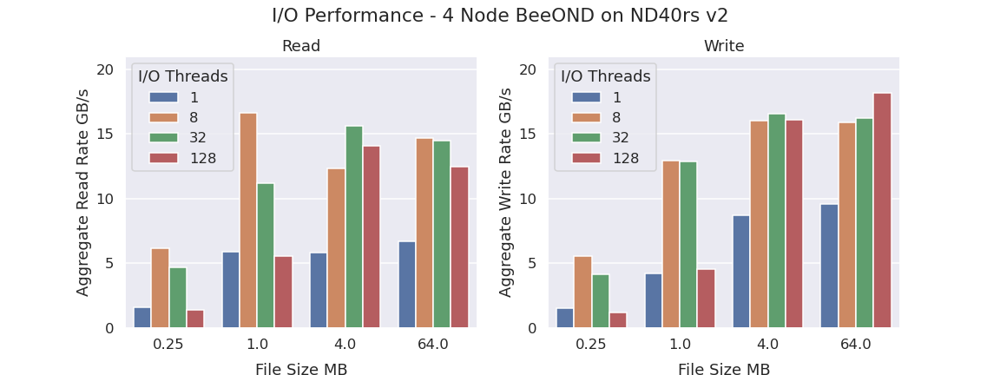

[](https://www.nag.com)

#### Author: Phil Tooley - [phil.tooley@nag.co.uk](mailto:phil.tooley@nag.co.uk)

# Tutorial: BeeOND + AzureML: A High Performance Filesystem for HPC-scale ML

The explosive growth in both the power and application of deep learning in recent years has been
fuelled both by advances in GPU computing hardware and also by the ever growing quantities of data
available in an increasingly connected world. As a result, modern high-performance machine learning
workloads can have huge datasets, well beyond 1TB in size, and scale to run on clusters with tens
or even hundreds of GPUs.  However, the massive compute power of modern GPUs comes with similarly
massive data throughput requirements, with a single GPU performing deep learning training capable
of consuming data at a rate of hundreds of MB/s and training clusters at rates of 10s to 100s of
GB/s. Avoiding bottlenecks due to data starvation requires a high performance data storage solution
which can scale to meet the capacity and throughput demands of the latest deep learning models and
GPU hardware.

The Azure Machine Learning platform provides a number of options for scalable dataset storage,
including directly mounting both Azure Blob and Azure Files. These services offer flexibility and
huge storage space, but what if your workload has I/O requirements that exceed the capabilities of
these network-attached storage options? Caching is a viable strategy for datasets which can fit
entirely in local machine memory or local disk storage, but for extreme sized datasets this is not
an option and we are restricted to streaming data as needed from some form of highly scalable
network storage.  In this tutorial we will demonstrate using the BeeOND filesystem as a
cost-effective and scalable solution for AzureML workloads with extreme I/O needs. Our [performance
benchmarks](#testing-the-performance) show that a cluster of 4 nodes can achieve over 15GB/s total
system bandwidth for both read and write.

## Workloads with Extreme I/O Requirements: CosmoFlow

As an example of a ML workload with extreme I/O requirements, let's look at CosmoFlow - a CNN-based
model for learning cosmological parameters of the universe from large 3D maps of dark matter
distributions.  CosmoFlow is one of the [MLPerf HPC benchmark] workloads, chosen because of its
extreme computational requirements: it has a massive 5.5TB benchmark dataset and distributed
training scales efficiently to 512 NVIDIA V100 GPUs and beyond, each GPU consuming data at an
average rate of ~300MB/s.  As is typical for ML workloads, CosmoFlow iterates over the full
dataset many times in a single run, however the dataset is far too large to be cached in memory or
node-local storage. As a result we will need to stream the data from some kind of high performance
data store.

[MLPerf HPC benchmark]: https://mlcommons.org/en/news/mlperf-hpc-v07/

For this tutorial we used the ND40rs v2 instance type in a 4 node cluster for a total of 32 GPUs -
this is a fairly modest cluster for the problem size but is already large enough to demonstrate the
problem of meeting I/O bandwidth requirements.  Each cluster node has 8 GPUs giving a per-node
throughput requirement of 2.5GB/s or 10GB/s for the whole cluster to train CosmoFlow without an
I/O bottleneck.  Given that Azure storage accounts have a maximum egress bandwidth of roughly
6.25GB/s (50Gib/s) it is clear that a single storage account will not provide the required
performance.  Azure NetApp Files is another option for high performance network-attached storage,
however maximum bandwidth for a single instance is around 4.5GB/s, so again a single NetApp Files
instance will not meet our requirements.  We could try using techniques such as sharding across
multiple instances of network-attached storage to scale the overall performance, but this approach
potentially adds significant additional cost, and fails to address another potential problem:
ethernet performance.

Standard ethernet adapters on Azure Virtual Machines are virtualised by the hypervisor. This means
that performance enhancing features such as hardware offloading are typically not available to the
guest virtual machine.  This can limit overall performance, for example when we benchmarked data
download performance from Azure Blob storage to a ND40rs v2 instance we found that throughput was
limited to around 750MB/s (6Gib/s) because of this issue.  Some Azure virtual machine types offer
SR-IOV enabled ethernet (known as "accelerated networking") which gives increased performance using
PCI passthrough, but this feature is currently in preview for Azure ML and is not yet recommended
for general usage.

Coming back to our ND40rs v2 VMs, however, they each come with around 3TB of local NVMe SSD
storage with read performance well in excess of 3GB/s.<sup>[1](#nvme_note)</sup> They also have
200GB/s infiniband cards directly passed through to the guest to provide full-rated performance, so
what if we just created a shared high performance filesystem (HPFS) on the fly with these same VMs
we are already using for compute?

<a name="nvme_note"><sup>1</sup><a/> *Of course if the dataset is small enough we can cache a
complete copy on each node, but we are looking for a solution that scales to extreme dataset
sizes.*


## A HPFS On-Demand

As it turns out we are far from the first to have had this idea and the developers of the
[BeeGFS](https://www.beegfs.io) high performance filesystem have produced the
[BeeOND](https://www.beegfs.io/wiki/BeeOND) (BeeGFS on Demand) tool to do exactly this.  There is
no reason that other high performance filesystems couldn't be used in the same way, but the fact
that BeeOND is specifically designed for on the fly use makes it the natural choice for this
tutorial.

Thanks to the work done by the BeeOND developers, deploying a BeeOND filesystem is a fairly
straightforward process, and requires three steps:

1. Install the BeeOND software components on all nodes in the cluster

2. Enable (passwordless) SSH for the BeeOND tool to communicate between nodes

3. Run the BeeOND setup tool on any one of the cluster nodes, specifying which nodes should be part
   of the filesystem, the local storage to use and where to mount the resulting BeeGFS filesystem.
   The tool will then connect to and automatically configure all the nodes to set up the
   filesystem.


## Integrating with AzureML

So now we know we can easily create a HPFS on the fly, how do we make it work with Azure ML?  In
our [previous tutorial] demonstrating Mask RCNN we showed how to use the Python SDK to configure
the full training workflow. This involved creating a compute cluster using the `AmlCompute` object,
configuring a `Workspace` object to use a custom Docker container for training, and finally
configuring and submitting a `Run` object to launch a training run.

If we want to integrate a BeeOND filesystem into our Azure Ml workflow there are three main
questions that we need to answer:

1. How do we access an AmlCompute cluster to configure BeeOND?

2. How do we configure things so our workload can access our new filesystem?

3. How do we efficiently stage our training data to our new filesystem?

In the rest of this tutorial we will show the steps needed to set up BeeOND and run a simple
Benchmarking script via AzureML.  In the [next tutorial](#) we will show how to fully integrate a 
BeeOND filesystem into an HPC-scale ML workflow training the CosmoFlow model.


## Installing BeeOND on an AmlCompute Cluster

AzureML can be configured to allow SSH access to our AmlCompute clusters while they are running, in
order to perform admin tasks.  To enable this we just need to provide an admin username and ssh key
when we create the cluster.  This can be done with either the ML Studio or the SDK interface.  We
used the Python SDK in the [previous tutorial] demonstrating how to set up a single workflow, and
we will build on those examples here as we add the BeeOND filesystem. As before, when we
demonstrated training Mask RCNN on AzureML, we will begin by creating a compute cluster. This time,
however, we must make sure we provide the admin username and ssh public key that we will use to
login to the the cluster later. We also need to disable autoscaling of the cluster this time - this
prevents us from losing our BeeOND filesystem because a node got shut down for being idle. To do
this we set the `min_nodes` and `max_nodes` to the same value e.g 4 to ensure the cluster size is
fixed and it won't autoscale.

[previous tutorial]: https://www.nag.com/blog/tutorial-training-scale-azureml

```python
from azureml.core import Workspace
from azureml.core.compute import AmlCompute

workspace = Workspace.get("AzureMLDemo")

cluster_config = AmlCompute.provisioning_configuration(
  vm_size="Standard_ND40rs_v2",
  min_nodes=4,
  max_nodes=4,
  idle_seconds_before_scaledown=300,
  admin_username="clusteradmin",
  admin_user_ssh_key=sshpubkey, # Contents of a public key file
  remote_login_port_public_access="Enabled"
  )

cluster = AmlCompute.create(workspace, "MyCluster", cluster_config)

cluster.wait_for_completion()
```

Once the cluster nodes are up and running we can connect to them via SSH and configure BeeOND.

### SSHing to AmlCompute Nodes

To connect to the nodes in the cluster we need to query the AzureML service for the IP address and
ports needed to connect.  This information can be found in the ML Studio but since we want to
configure multiple nodes it makes sense to use Python scripting to automate the process.  To get
connection information for all cluster nodes we can use the `AmlCompute.list_nodes()` method. Once
we have the connection information we can then ssh to them manually or use a Python SSH client such
as `paramiko` or `parallel-ssh` to connect to the nodes and configure them:

```python
nodelist = cluster.list_nodes()

print("Node connection information:")
for i, node in enumerate(nodelist):
  print("\tNode {}: IP: {} - Port: {}".format(i, node['publicIpAddress'], node['port']))

# Parallel-SSH connection example:
from pssh.clients import SSHClient

client = SSHClient(node['publicIpAddress'], port=node['port'], user="clusteradmin")
host_out = client.run_command('nvidia-smi')
for line in host_out.stdout:
    print(line)
    exit_code = host_out.exit_code
```

In the examples provided with this tutorial we have included a `ClusterConnector` class in the file
[`clusterconnector.py`]. This includes all the functionality to create a cluster and manage
parallel ssh connections, with methods to copy files and run commands on all nodes at once, or to
run them only on the master node.

[`clusterconnector.py`]: https://github.com/numericalalgorithmsgroup/AzureML_Best_Practice/blob/master/beeond/clusterconnector.py

To use the clusterconnector class to create a new cluster and run a command on all the nodes you
would do the following:

```python
from clusterconnector import ClusterConnector
clusterconn = ClusterConnector(
    workspace=workspace,
    cluster_name="MyCluster",
    ssh_key=sshpubkey,
    vm_type="Standard_ND40rs_v2",
    admin_user="clusteradmin",
)
clusterconn.initialise(min_nodes=4, max_nodes=4)

clusterconn.run_on_all_nodes('nvidia-smi')
```

Now files can be copied to and commands run on all or just the master node using the
`copy_to_all_nodes` and `run_on_all_nodes` or `copy_to_master_node` and `run_on_master_node`
methods respectively.


### Setting up SSH Keys

To ensure that our nodes can connect to each other for the BeeOND setup we need to set up
passwordless SSH, and also make a nodelist of all the private IP addresses for the nodes in the
cluster.  In this instance because we have a private cluster we will use passwordless SSH keys,
though this may not be appropriate for some production environments.  The script below will create
a list of all the node private IP addresses, along with a passwordless SSH key pair and copy these
files to all the nodes.

```python

node_list = clusterconn.cluster.list_nodes()

with open('nodefile', 'wt') as fh:
  for node in node_list:
    fh.write("{}\n".format(node['privateIpAddress']))

clusterconn.copy_to_all_nodes('nodefile', '~/nodefile')

ssh_keygen = (r'sudo ssh-keygen -b 4096 -f /root/.ssh/id_rsa -N "" && '
              r'sudo cat /root/.ssh/id_rsa.pub' | tee $HOME/masterkey')
clusterconn.run_on_master_node(ssh_keygen)
clusterconn.copy_from_master_node('~/masterkey', 'masterkey')
clusterconn.copy_to_all_nodes('masterkey', '~/masterkey')

```
This approach directly generates the private key on the master node and avoids copying it around
between different nodes to minimize potential security issues.  The public key is then copied back
from the master to all the other nodes. We will move the public keys to their final locations on
the worker nodes in the next step.

### Installing the BeeOND software

BeeOND is available as prebuilt packages for the Ubuntu distribution that Azure ML uses.
Installation is therefore a matter of adding the BeeOND package repository and then installing the
BeeOND package.  To do this efficiently using `ClusterConnector` we can create an install script to
be run on all the nodes.  We will also add some extra logic to this script to make sure that the
SSH keys are copied to the correct place and set some configuration options for the BeeOND
installer. Below is a script to provision BeeOND on systems running Debian 9/Ubuntu 18.04.

```bash
#!/bin/bash

echo "Installing master public key:"
cat masterkey | sudo tee -a /root/.ssh/authorized_keys

echo -e "\n\n### Provisioning BeeOND FS:\n"

echo "Adding BeeOND public key"
wget -q https://www.beegfs.io/release/latest-stable/gpg/DEB-GPG-KEY-beegfs -O- | sudo apt-key add -

echo "Adding BeeOND repo"
wget -q https://www.beegfs.io/release/beegfs_7.2/dists/beegfs-deb9.list -O- | \
  sudo tee /etc/apt/sources.list.d/beegfs-deb9.list &>/dev/null

echo "Updating apt index and installing BeeOND"
sudo apt-get update -q
sudo apt-get install -y beeond

echo "Configuring path to kernel headers"
cat <<EOF | sudo tee /etc/beegfs/beegfs-client-autobuild.conf
buildArgs=-j20 OFED_INCLUDE_PATH=/usr/src/ofa_kernel/default/include
buildEnabled=true
EOF
```
This script does a number of different things. The first is to copy the public key we created in
the previous step to it's final location in the `/root` folder. Next the BeeOND file repository and
it's public key are added to the package manager configuration to allow us to install the BeeOND
packages.  Then the package manager index gets updated and the BeeOND software installed. Finally a
small configuration snippet is added for the BeeOND client so that it can find some necessary build
dependencies later.

Now we can use the `ClusterConnector` again to copy this script to all the nodes and run it (as
root), this example assumes the script is saved as [`provision_beeond.sh`]:

[`provision_beeond.sh`]: https://github.com/numericalalgorithmsgroup/AzureML_Best_Practice/blob/master/beeond/provisioning/provision_beeond.sh

```python
clusterconn.copy_to_all_nodes('provision_beeond.sh', '~/provision_beeond.sh')
clusterconn.run_on_all_nodes('sudo bash ./provision_beeond.sh')
```

### Starting the BeeOND Filesystem

Finally we can start the BeeOND filesystem.  To do this we run the startup script on just one of
the nodes, and provide it with the nodelist we uploaded earlier to tell BeeOND which nodes to use
in the cluster.  We also pass options to tell it what path to use for the underlying storage
(`/mnt/resource` for the local NVMe on our VMs) and what path to mount the filesystem at
(we will use `/mnt/scratch` for this tutorial). Once again we can use the clusterconnector for
this:

```python
beecmd='sudo beeond start -n nodefile -f /root/bgconf -d /mnt/resource -c /mnt/scratch -F'
clusterconn.run_on_master_node(beecmd)
```

Along with the `ClusterConnector` class the examples accompanying this tutorial also include a
`BeeONDClusterConnector` class.  This implements all the steps in this section so that a
ready-to-use cluster, complete with BeeOND filesystem can be created very simply:

```python
from clusterconnector import BeeONDClusterConnector

beeclusterconn = BeeONDClusterConnector(
    workspace=workspace,
    cluster_name="MyCluster",
    ssh_key=sshpubkey,
    vm_type="Standard_ND40rs_v2",
    admin_user="clusteradmin",
)
beeclusterconn.initialise(num_nodes=4, beeond_mnt="/mnt/scratch")
```

This implements all the steps shown above to create a fixed size 4 node cluster with the BeeOND
filesystem mounted at `/mnt/scratch`.

## Using BeeOND in AzureML Workloads

Like in our Mask-RCNN tutorial we will be using a custom Docker container to deploy our workload,
and we define this in the `Environment` object for our training in the same way as before.  The
AzureML SDK provides various configuration options for Docker, including a way for us to pass
custom Docker command line arguments. We can use this to pass an argument to bind mount our new
BeeOND filesystem into the Docker container at whatever mount point we like.  For example, to map
our Beeond FS at `/mnt/scratch` to a directory `/data` in the container we would pass the argument
`-v /mnt/scratch:/data`. Combining this with the code we used previously to create an environment
based on a custom Dockerfile, gives:

```python
from azureml.core import Workspace, Environment

workspace = Workspace.get("AzureMLDemo")

environment = Environment("CosmoFlowDockerEnvironment")

environment.docker.enabled = True # Tell AzureML we want to use Docker
environment.docker.base_dockerfile = "./MyDockerfile" # Path to local Dockerfile
environment.python.user_managed_dependencies = True  # AzureML shouldn't try to install things

environment.docker.arguments = ['-v', '/mnt/scratch:/data'] # Bind mount our BeeOND FS

environment = environment.register(workspace) # Validate and register the environment
```

Now when our workload runs it will be able to access the BeeOND filesystem under the `/data`
directory inside the container.


## Testing the Performance

To assess the performance of our filesystem we used the
[elbencho](https://github.com/breuner/elbencho) storage benchmarking tool. It has been specifically
designed to test the performance of modern distributed storage filesystems and supports
orchestration of operations from many clients simultaneously.  elbencho supports a range of
different tests including whole-device, filesystem read/write and GPU data transfer benchmarks.
For this tutorial we opted to perform filesystem read/write tests to demonstrate the performance of
BeeOND as a general purpose solution for high performance storage.

To actually run the benchmark we installed elbencho in a custom Docker container for use with
AzureML.  The [`Dockerfile`] for this is available in the [accompanying GitHub repository]. The
benchmarking job can then be submitted similarly to in our [Mask R-CNN tutorial].  In this case
we will instruct AzureML to run a bash script which orchestrates running elbencho with the desired
configurations - we can do this by passing a `command` argument to `ScriptRunConfig` rather than a
`script` argument, e.g.

[`Dockerfile`]: https://github.com/numericalalgorithmsgroup/AzureML_Best_Practice/blob/master/beeond/Dockerfile
[accompanying GitHub repository]: https://github.com/numericalalgorithmsgroup/AzureML_Best_Practice/tree/master/beeond
[Mask R-CNN tutorial]: https://github.com/numericalalgorithmsgroup/AzureML_Best_Practice/tree/master/maskrcnn

```python
script_conf = ScriptRunConfig(
        source_directory="scripts",
        command=["bash", "./run_elbencho_multifile.sh", ...],
        compute_target=clusterconnector.cluster,
        environment=environment,
        distributed_job_config=parallelconfig,
    )
```

Note that `script` explicitly expects a Python script, while `command` will accept any
valid Linux command line. The full job submission script can be found in the GitHub repository as
[`beeond_run_elbencho.py`], along with the elbencho orchestration script
[`scripts/run_elbencho_multifile.sh`].

[`beeond_run_elbencho.py`]: https://github.com/numericalalgorithmsgroup/AzureML_Best_Practice/blob/master/beeond/beeond_run_elbencho.py
[`scripts/run_elbencho_multifile.sh`]: https://github.com/numericalalgorithmsgroup/AzureML_Best_Practice/blob/master/beeond/scripts/run_elbencho_multifile.sh

In our case we tested a 4 node BeeOND cluster of ND40rs_v2 instances. We benchmarked concurrent
read and write performance from all nodes simultaneously, with filesizes from 256kB to 64MB and 1
to 128 I/O threads per client - recall that in this case cluster nodes are both a storage server
and a client.  Each test used a total of 12800 files and all file caches were dropped before and
after each phase to ensure that read benchmarks are truly from NVMe and not from RAM cache.  The
results we got for our 4 node cluster is shown below.



These are impressive results for untuned "out of the box" performance on 4 nodes, with total system
bandwidth reliably exceeding 10GB/s or 2.5GB/s/node for larger files with multiple parallel I/O
threads per client. This performance is comfortably sufficient for CosmoFlow which needs around
2.5GB/s/node read performance for roughly 16MB data files and highly parallel access patterns.  In
some cases read performance can exceed 15 GB/s total system bandwidth and write performance can
also reliably exceed 15 GB/s for parallel writes of larger files.  Looking more closely at trends
in the data we can also see that there are two distinct performance regimes visible here - metadata
limited and bandwidth limited.  

The metadata limited regime occurs for smaller files where the total throughput depends on the
BeeGFS metadata server's ability to keep up with the number of files being accessed. For example,
at 256kB  and 1MB files, for both read and write, performance increases when going from 1 to 8
parallel I/O threads per node, but as the number of threads increases further performance stalls
and then degrades again as the metadata server becomes overloaded with requests. By default the
BeeOND tool only sets up a single metadata server for a cluster instance, we could likely improve
the small file *read* performance if we needed to by adding another metadata server. Improving
write performance is a little more complicated with multiple metadata servers because
synchronisation of the metadata becomes an issue.

At the other end of the spectrum is the I/O bandwidth limited case. This can be seen for large
files where the rate of metadata requests is much lower and a lot more data needs to be transferred
for each file.  In this case, initially adding more I/O threads can improve performance, stalling
once the I/O bandwidth of the NVMe disks is saturated, but there is a smaller performance dropoff
caused by the increased contention than for the metadata limited case. This is more of an issue for
reading than writing data, mostly due to the fact that when writing the system can additionally
make use of write caching to improve effective write rates.  This is not possible for the read
benchmark as we deliberately drop all caches to ensure we are reading all data from NVMe. It is
also important to note that throughput for any individual file is likely to be impacted by
increased contention, slowing I/O for that file, although the effect is not visible when looking at
the total system bandwidth.


## Conclusion

In this tutorial we have shown you how to set up a compute cluster in AzureML backed with a high
performance BeeGFS on Demand (BeeOND) filesystem.  You can use this to provide high performance
storage for both containerised and non-containerised ML workflows on AzureML to maximise data
throughput to the GPUs in your training cluster.

The accompanying Github repository includes all the scripts you need to set up a cluster and run
the elbencho storage benchmarking tool as an example workload.  Running this benchmark on our 4
node test cluster we were able to achieve total system bandwidth of over 15 GB/s read and write out
of the box with no additional performance tuning.

In our [next tutorial](#) we will demonstrate how to run the HPC-scale CosmoFlow deep learning
model on a BeeOND enabled cluster and achieve supercomputer level performance in the Azure cloud.

**Copyright 2021, Numerical Algorithms Group Ltd (The)**

#### Contact: 
Numerical Algorithms Group Ltd<br>
30 St Giles'<br>
Oxford<br>
OX1 3LE<br>
UK<br>
[www.nag.com](https://www.nag.com)
