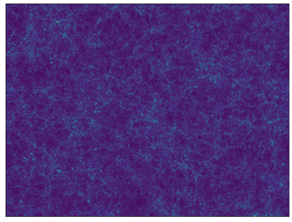
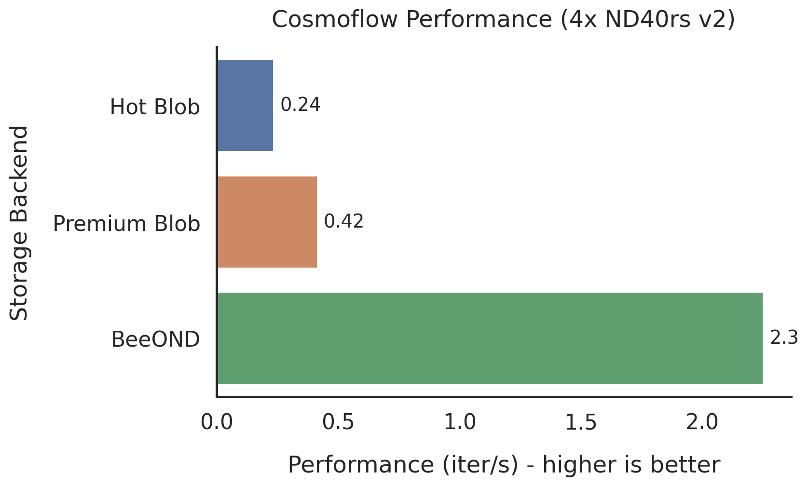
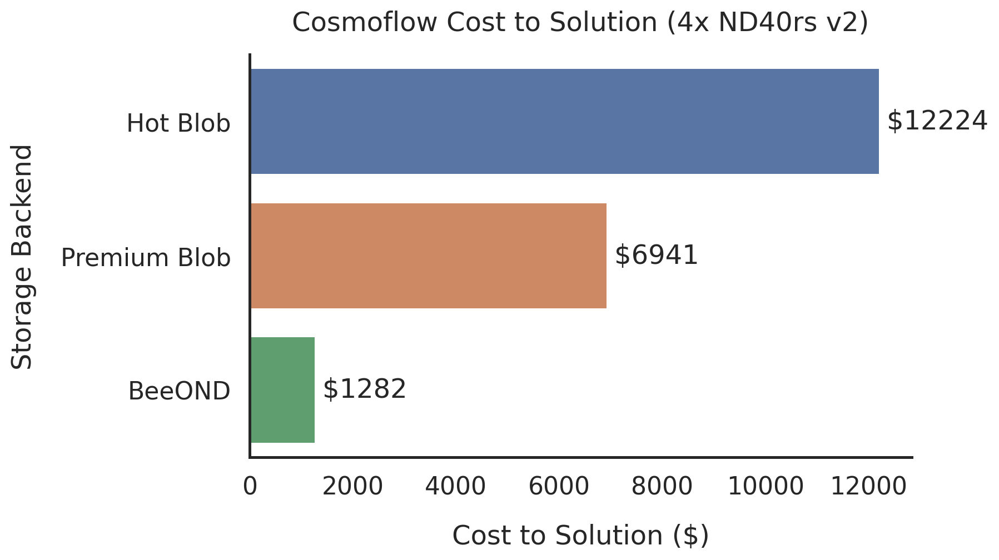

[](https://www.nag.com)

#### Author: Phil Tooley - [phil.tooley@nag.co.uk](mailto:phil.tooley@nag.co.uk)

# ***DRAFT: For Partner Review***

# Tutorial: HPC-Scale AI on AzureML: Training CosmoFlow

*In our previous tutorials we have shown you how to [run training workloads on the AzureML
platform] and [set up an HPC-class high performance filesystem]. Now we will put everything
together to train an HPC-scale ML model.*

[run training workloads on the AzureML platform]: https://www.nag.com/blog/tutorial-training-scale-azureml

In our previous blog post on [adding the BeeOND filesystem to AzureML] we used the CosmoFlow
cosmological parameter estimation model as a motivation for needing high performance filesystems
when training large scale models.  In this tutorial we will demonstrate the steps needed to train
CosmoFlow on AzureML using a BeeOND filesystem for storage and demonstrate the [almost 10x
speedup](#performance-comparison-beeond-vs-blobfuse) this gives over Azure-blob based Dataset
storage.

## CosmoFlow - The Model and Dataset

[CosmoFlow](https://arxiv.org/abs/1808.04728) is a scientific machine learning model for
determining the cosmological parameters of the visible universe from 3D maps of the dark matter
distribution within it.  The network itself is fairly simple by the standards of modern
state-of-the-art machine learning - it is a conovolutional neural network with 7 convolutional and
3 fully connected layers.  However, the challenge for efficiently training CosmoFlow comes from the
size of the dataset and the performance it demands of the underlying storage hardware, for this
reason it was chosen as an [MLPerf HPC Benchmark] model.

[MLPerf HPC Benchmark]: https://mlcommons.org/en/news/mlperf-hpc-v07/


The training dataset for the [MLPerf HPC Benchmark configuration] comes in at around 5.1TB
(training + validation) requiring significant storage space.  When we benchmarked throughput
requirements using a small subset of the data on a single Azure ND40rs v2 node we found that each
of the 8 NVIDIA V100 GPUs consumed data at a rate of ~300MB/s meaning each node requires ~2.5GB/s
of throughput from the data storage solution.  As we discussed in the [BeeOND tutorial] Azure's
network attached storage options do not provide a scalable solution for this, however, a BeeOND
filesystem provides a high performance solution with no additional resource costs.

[MLPerf HPC Benchmark configuration]: https://github.com/sparticlesteve/cosmoflow-benchmark

The [BeeOND] tool allows a BeeGFS filesystem to be created on the compute nodes in a just-in-time
fashion, just before the training job is started. This combines the fast NVMe scratch storage and
high performance InfiniBand interconnects available on the compute nodes to create a scalable
distributed filesystem which can be scaled up as needed by adding additional compute nodes.  Our
testing has demonstrated the ability to scale well beyond the 2.5GB/s/node performance required to
train CosmoFlow in a multi-node cluster.

[BeeOND]: https://www.beegfs.io/wiki/BeeOND

## Preparing the Dataset

Because the BeeOND filesystem is not permanent, the data must be staged to the filesystem before we
can run the training job. This uses the slower ethernet network to copy data from Azure network
attached storage, however this only occurs once per job. The BeeOND filesystem still provides a
large speedup because the dataset must be read many times during training and it is too large to
cache a separate copy on each node.

In the case of CosmoFlow we first need to download the benchmark dataset and store it in an Azure
blob storage account.  The dataset is [hosted by NERSC](https://portal.nersc.gov/project/m3363/)
and can be downloaded either via http or using a [Globus parallel FTP endpoint].  The data can be
downloaded to a suitable machine before uploading to Azure storage.  We chose to use Globus to
perform the download to an L32s v2 instance in the same Azure region that we used for the training
cluster (South Central US), with the transfer taking a little over 16 hours to complete.

[Globus parallel FTP endpoint]: https://app.globus.org/file-manager/collections/f59a3318-df18-11e9-b5de-0ef30f6b83a8/overview?back=endpoints

With the data sucessfully downloaded we can move on to storing the data in Azure Blob for long term
storage. From there we can stage it to our BeeOND filesystem as needed for training and
benchmarking runs.

### Transferring with AzCopy

There are multiple ways to transfer data to/from Azure Blob storage including the ReST API,
BlobFuse driver and the [AzCopy] tool.  For copying large amounts of data to or from blob storage
AzCopy has a number of advantages, including automatic parallelisation of transfers and built-in
compression support allowing transparent decompression of files during download. This transparent
decompression feature is particularly useful as it allows us to both speed up the staging time to
BeeOND by reducing the total data transfer size, and lower costs by reducing the total size of the
stored data.

[AzCopy]: https://docs.microsoft.com/en-us/azure/storage/common/storage-ref-azcopy

In the case of the CosmoFlow benchmark dataset compression of individual files with gzip reduced
the total dataset size from 5.1TB to 1.1TB, reducing storage costs to ~1/5 of the uncompressed
size.  Compression was done on the L32s v2 virtual machine used for staging the data, and took
around 1 hour using 32 parallel processes.  To ensure that the data is correctly identified as
compressed (and therefore decompressible), the content-encoding metadata field must be set as
"gzip" when uploading the data to Azure Blob.  This can be done when uploading with AzCopy by
passing the flag `--content-encoding="gzip"`.  For example, to upload all compressed dataset files
(named `*.tfrecord.gz`) in the `cosmo_data` directory to a container named `cosmoflow_dataset` in
the `azurebestpractice` storage account, suitably marked for transparent decompression later:

```shell
$ storage_acct="azurebestpractice"
$ container="cosmoflow_data"
$ sas="..."
$ azcopy copy --recursive --include-pattern="*.tfrecord.gz" --content-encoding="gzip" \ 
  ./cosmo_data https://${storage_acct}.blob.core.windows.net/${container}?sv=${sas}
```

You should substitute your own storage account, container and shared access signature (SAS) when
uploading your data with AzCopy.  Shared access signatures are a recommended method for
authenticating to storage accounts from scripts without revealing sensitive credentials such as an
account key.  They provide control of access permissions (read, write, etc.), start and end times
for allowed accesss and fine-grained scoping down to the level of individual blobs. The [Azure
Storage Docs] contain all the information you need to know to create and manage shared access
signatures.

[Azure Storage Docs]: https://docs.microsoft.com/en-us/azure/storage/common/storage-sas-overview


## Staging the Dataset to BeeOND

Once the data has been uploaded to Azure Blob it can be staged to a BeeOND filesystem as needed.
We recommend using AzCopy for this step as well, and it is essential if you wish to use
transparent decompression.

To minimise the time cost of staging the data we ideally want to shard the data staging over as
many nodes as possible.  Because we are staging to a shared filesystem it doesn't matter which
node downloads which file from the blob storage and we can choose how we shard the staging
downloads entirely arbitrarily (provided the overall data size is roughly equal between nodes to
maximise efficiency).  We can use the filename filtering capabilities of AzCopy to perform this
sharding by limiting each node to copying a subset of the dataset files.

*Note: When writing and testing this tutorial (May 2021), accelerated networking was not generally
available for AzureML compute cluster nodes, limiting the download throughput from Azure blob via
the virtual NIC to about 5-6Gb/s.  So for a single storage account we can expect to shard over 9-10
nodes before we hit the storage account egress bandwidth limit of 50Gb/s.  For staging very large
datasets it may be worth sharding the at-rest storage over multiple storage accounts to improve
overall staging throughput.*


### Sharding the staging using AzCopy

There are two potential ways that we could choose to perform the sharding with AzCopy.  The first
is to pass an explicit download list to each AzCopy invocation. This could be useful if, for
example, the dataset files have arbitrary names with no common pattern.  However, this requires
some additional metadata tracking to either store or build these file lists on the fly for the
appropriate number of staging worker nodes. Thankfully if there is a pattern to how the dataset
files are named there is a simpler alternative: we can use pattern-based filtering to instruct
each AzCopy instance to download a subset based on filename pattern matching.

In the case of the CosmoFlow benchmark dataset the files comes in groups of 64 with a regular
naming scheme. Individual filenames follow the pattern `univ_ics_2019-03_aXXXXX_YYY.tfrecord` where
XXXXX is an arbitrary number and YYY goes from 000 to 063.  Therefore to evenly split the download
between e.g 16 nodes, we can provide AzCopy suitable filename based filters based on the rank of
the staging node such that rank 0 downloads files numbered 000-003, rank1 downloads 004-007 and so
on. E.g., for node 0:

```shell
$ azcopy copy --recursive --decompress \
  --include-pattern="*_000.tfrecord.gz,*_001.tfrecord.gz,*_002.tfrecord.gz,*_003.tfrecord.gz" \
  https://${storage_acct}.blob.core.windows.net/${container}?sv=${sas} /mnt/beeond/cosmodata
```

As before, you will need to provide your own account, container and matching SAS when you come to
stage the data to your own BeeOND cluster. In our testing using 4 nodes we found that the staging
time for the uncompressed dataset was a little over 35 minutes while enabling transparent
decompression reduced this to about 13 minutes.  This is not quite the 5x speedup that might be
expected just from the bandwidth reduction because there are also decompression overheads, but the
speedup is definitely big enough to be worth the additional effort required!

Ideally we would like to have this staging process automatically performed when the training job is
run by AzureML.  To make this happen we will need to make some small changes to the CosmoFlow
training script to perform the data staging before launching the training process.

## The Software Environment

CosmoFlow is based on the [TensorFlow] machine learning framework.  As a result we need a slightly
different Docker container than we have used in the past, based on the NVIDIA NGC Tensorflow image
rather than the PyTorch one. Beyond this change the process of adding the extra requirements for
AzureML remains the same.  Unlike Mask R-CNN, CosmoFlow does not require installation as a package
package as a result the required Docker file is quite simple  and can be used as a basis for any
TensorFlow based ML workload:

```Dockerfile
# Build image on top of NVidia MXnet image
ARG FROM_IMAGE_NAME=nvcr.io/nvidia/tensorflow:20.12-tf1-py3
FROM ${FROM_IMAGE_NAME}

# Install AzureML system deps
RUN wget https://packages.microsoft.com/config/ubuntu/20.04/packages-microsoft-prod.deb \
    -O packages-microsoft-prod.deb && \
    dpkg -i packages-microsoft-prod.deb && \
    apt-get update && \
    apt-get install -y libcap2 libfuse-dev python3-pip dotnet-runtime-2.1 openssh-server

### Install Mellanox Drivers ###
ENV MOFED_VER 5.2-2.2.0.0
ENV OS_VER ubuntu20.04
ENV PLATFORM x86_64
RUN wget --quiet http://content.mellanox.com/ofed/MLNX_OFED-${MOFED_VER}/MLNX_OFED_LINUX-${MOFED_VER}-${OS_VER}-${PLATFORM}.tgz && \
    tar -xvf MLNX_OFED_LINUX-${MOFED_VER}-${OS_VER}-${PLATFORM}.tgz && \
    MLNX_OFED_LINUX-${MOFED_VER}-${OS_VER}-${PLATFORM}/mlnxofedinstall --user-space-only --without-fw-update --all --without-neohost-backend --force && \
    apt-get install -y libibverbs1

### Install Python Dependencies ###
RUN pip install azureml-defaults

# !!!! INSERT YOUR REQUIRED PACKAGE INSTALLATIONS HERE !!!!
```

Because CosmoFlow requires no installation we can deploy it by uploading the various Python files
via the ML runtime during job submission. A copy of the CosmoFlow implementation along with AzureML
specific modifications we made to it are available in the accompanying [GitHub repository] in the
[`cosmoflow-benchmark`] directory.

[GitHub repository]: https://github.com/numericalalgorithmsgroup/AzureML_Best_Practice/tree/master/cosmoflow
[`cosmoflow-benchmark`]: https://github.com/numericalalgorithmsgroup/AzureML_Best_Practice/blob/master/cosmoflow/cosmoflow-benchmark

## Modifying CosmoFlow for AzureML

There are multiple ways that we could modify an existing ML model to add features and compatibility
for AzureML. These include directly modifying the Python training script to add what we need or
launching the training via a wrapper script.  In the case of CosmoFlow we need to pass a lot of
command line arguments to our script, but we will also want to pass arguments to the data staging
logic such as the storage account name, container name and a valid SAS to download the data. So a
wrapper script would need to parse the command line, extract what it needs and pass the rest to the
training script.  If we modify the training script instead, we can use the argument handling
functionality that CosmoFlow already has and simply include the extra options and logic we need.

We have included most of the additional code in an additional Python module named
[`beeondutils.py`], that provides a function `pull_data_from_blob_sharded`. This takes the storage
account connection information, BeeOND filesystem path and parallel environment information and
manages the downloading of the appropriate shard of the total dataset.

[`beeondutils.py`]: https://github.com/numericalalgorithmsgroup/AzureML_Best_Practice/blob/master/cosmoflow/cosmoflow-benchmark/beeondutils.py

The training script is modified to accept the additional command line arguments `--account`,
`--container`,  `--sas` and `--beeond-stage-dir`. These are used to pass the information needed to
access the storage account and the target directory where BeeOND is mounted to stage the data into.

The modified version of the training script is named [`train_beeond.py`] and is provided
alongside the original, unmodified [`train.py`] in the [GitHub repository] that accompanies
this tutorial.

[`train_beeond.py`]: https://github.com/numericalalgorithmsgroup/AzureML_Best_Practice/blob/master/cosmoflow/cosmoflow-benchmark/train_beeond.py
[`train.py`]: https://github.com/numericalalgorithmsgroup/AzureML_Best_Practice/blob/master/cosmoflow/cosmoflow-benchmark/train.py

### BeeOND Staging Logic

The sharding logic needed for CosmoFlow is relatively straightforward. First the script collects
information about the parallel environment. For CosmoFlow the parallelization is performed using
Horovod which in turn uses MPI with one MPI process per GPU.  If the process detects that it is the
first (index 0) process on the node it will call the staging function, otherwise it will simply
wait for the signal to continue. Only the first process takes part on each node because AzCopy has
its own parallel behaviour and we only need to run one process on each node.  

The staging function on each node now calculates which files it needs to request and build a filter
expression accordingly.  Because the files are arranged in groups of 64 with suffixes from 000-063
this can be done by dividing these indexes as evenly as possible between the nodes and constructing
filter expressions as shown above.

Finally, the staging can be performed using AzCopy.  The staging function will collect its own copy
of AzCopy at runtime to avoid the need to include it in the image and ensure the most up to date
version is always used.

Once all AzCopy operations are completed the training script can continue as before.

## Running Training Jobs and Getting Results

When it comes to submitting the jobs the overall experience is the same as in previous runs. The
script [`train_beeond.py`] is run on the local machine and coordinates the various stages.
First the cluster must be provisioned and the BeeOND filesystem initialised.  In our tutorial
scripts this is done via the `BeeONDClusterConnector` class which we described in detail in the
[BeeOND filesystem tutorial]. 

Once the compute cluster is up and running and the BeeOND filesystem is mounted the training job
can be submitted.  At this point the AzureML scheduler takes over and launches the custom Docker
container on each cluster node, mapping the BeeOND filesystem through into the container on each
node.  When the training script is launched inside the container the staging logic we have added to
the training script will copy the data from Azure Blob storage to the BeeOND filesystem.  Finally,
once the staging is complete the training script continues and trains the CosmoFlow model.

The outputs from CosmoFlow are written to the `output` folder in the working directory.  AzureML
considers this as a special folder and automatically archives its contents at the end of the run to
allow later download and inspect via the ML Studio or the AzureML SDK.

## Performance Comparison: BeeOND vs. BlobFuse 

So far we have claimed that the performance of BeeOND-based workloads will be far better than
BlobFuse based workflows based on synthetic benchmarks of BeeOND and rated performance numbers of
Azure Blob. But what happens in the real world, is it really worth all the extra effort to set up
BeeOND?  To find out we tested the performance of the full CosmoFlow workload with 3 different
storage backends: BeeOND, Hot Blob via BlobFuse and Premium Blob via Blobfuse.  We used the MLPerf
HPC Benchmark configuration for CosmoFlow itself.  The results, shown in the graph below, speak for
themselves:



We see an almost 10x improvement using BeeOND over Hot tier Blob storage and more than 5x
improvement versus using Premium tier Blob storage.  To give a sense of the wallclock time
difference, a single training epoch (one complete iteration over the full dataset) takes roughly
15 minutes for the BeeOND-backed implementation on 4 ND40rs v2 nodes (32 GPUs total).  In
comparison, the Premium Blob backed version takes roughly 75 minutes and the Hot blob backed
version well over two hours to complete one training Epoch.  When running our benchmarking we
allowed the BeeOND version of the benchmark to run to completion but halted both the Blob backed
versions after several epochs to reduce costs.

The complete training of the BeeOND-backed implementation required 48 epochs to reach target
accuracy and took just over 11.5 hours. At a cost of $26.438/hr (on-demand price) for each ND40rs
v2 instance this 4 node training cluster cost a little over $1200 to train the CosmoFlow model.  In
comparison if we had used premium blob, 48 epochs would have taken over 60 hours at a cost of
around $7000, and hot blob over 110 hours and $12000 for the same result.  This highlights the
importance of ensuring that I/O performance is sufficient to support GPU workloads in order to
minimize both time- and cost-to-solution.



## Summary

High performance storage is a critical component of modern AI training deployments - without
sufficient I/O bandwidth to supply them with data the computing power of modern GPUs is wasted.
Using CosmoFlow as an example we find that a BeeOND high-performance filesystem backed
implementation is over 5x faster than using Premium Blob and nearly 10x faster than using Hot Blob
for storage. BeeOND runs on the compute instances and requires no additional cloud resources,
meaning cost to solution is reduced by the same factor of 5 or 10x.  As GPUs become ever more
powerful, ensuring you have storage that can meet their demands is crucial to deliver best AI
training performance at best cost.


### Find out more:

* Watch our [GTC presentation] on BeeOND-enabled AzureML workloads
* Check out our other AzureML tutorials: [Training at Scale on AzureML] and [BeeOND + AzureML]

[GTC presentation]: https://gtc21.event.nvidia.com/media/Enabling%20Extreme%20I_O%20Workloads%20on%20Azure%20Machine%20Learning%20with%20Just-in-Time%20High-Performance%20File%20Systems%E2%80%8B%20(Presented%20by%20Microsoft%20Azure)%20%5BSS33167%5D/1_ff4d7541

[Training at Scale on AzureML]: https://www.nag.com/blog/tutorial-training-scale-azureml
[BeeOND + AzureML]: #

## About NAG

[NAG](www.nag.com) has played a leading role in numerical, scientific and High Performance 
Computing (HPC) for over 50 years and is one of the few organizations that have genuine expertise
and experience in all aspects of HPC and cloud.  We offer a range of HPC and cloud services
including:

* [Cloud HPC Migration](https://www.nag.com/content/nag-cloud-hpc-migration-service)
* [Software Optimization](https://www.nag.com/content/software-modernization-service)
* [Accelerator Porting and Tuning](https://www.nag.com/content/gpus-and-accelerator-code-tuning)

as well as fully bespoke consultancy in all aspects of HPC both on-premises and in the cloud. For
more information please reach out to us at [info@nag.com](mailto:info@nag.com).

